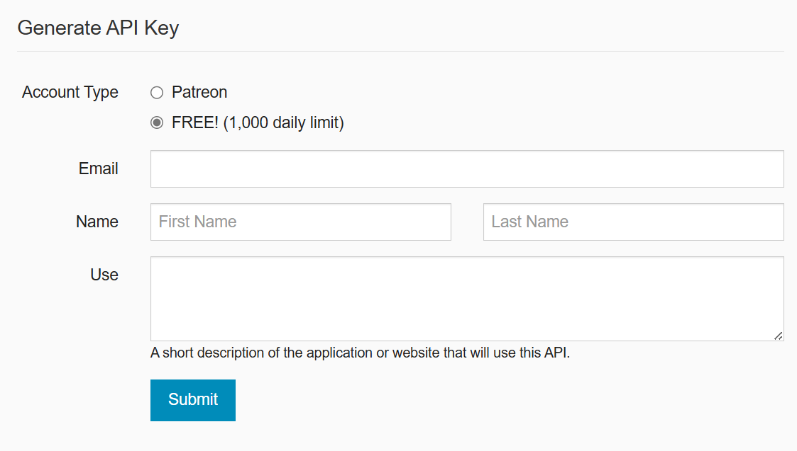

# Project:Movie Application Using OMDB API
#### Objective: Build a web application that utilizes the Open Movie Database (OMDB) API to display movie information.

#### API: https://www.omdbapi.com/

#### Task:
    1.Apply Data Filter Like Year
    2.Create Engaging UI to display Movie Data
    3.Show Details Like Box Office Collection, Rating, etc.
____
#### Technical Details Check:

| Technical Task              | Status   |
|-----------------------------|----------|
| Error Handeling             | &check;  |
| Github Repo                 | &check;  |
| README.md                   | &check;  |
| Handel Sensitive Data       | &check;  |
| Alternative Method For Data | &check;  |


____
#### Technology Used
1. StreamLit Framework For Making UI
2. Python-DotEnv for Security
3. GitHub and GitHub Action for CI-CD
4. StreamLit Server for Deployment

____


#### Setup Guide For Local Deployment
1. Download Repository
```shell 
git clone https://github.com/YugT28/MovieApplication.git
```
2. Create Environment and Activate
```shell 
python -m venv .venv
. .venv/Scripts/activate
```
3. Download and Install Requirement
```shell 
pip install -r requirements.txt
```
4. Create .env file
```shell 
touch .env
```

5. Add API Key to .env file 
```text
  API_KEY = <OMDB_API_KEY>
```
6. Run Application 
```shell 
streamlit run Search.py
```
____

#### Get API From 
1. Visit: https://www.omdbapi.com/apikey.aspx.
2. Add Data and Submit.
3. API_KEY will be mailed to Email Provided.
4. Activate API by visiting Email.

____

#### Data Source API Additionally

____


